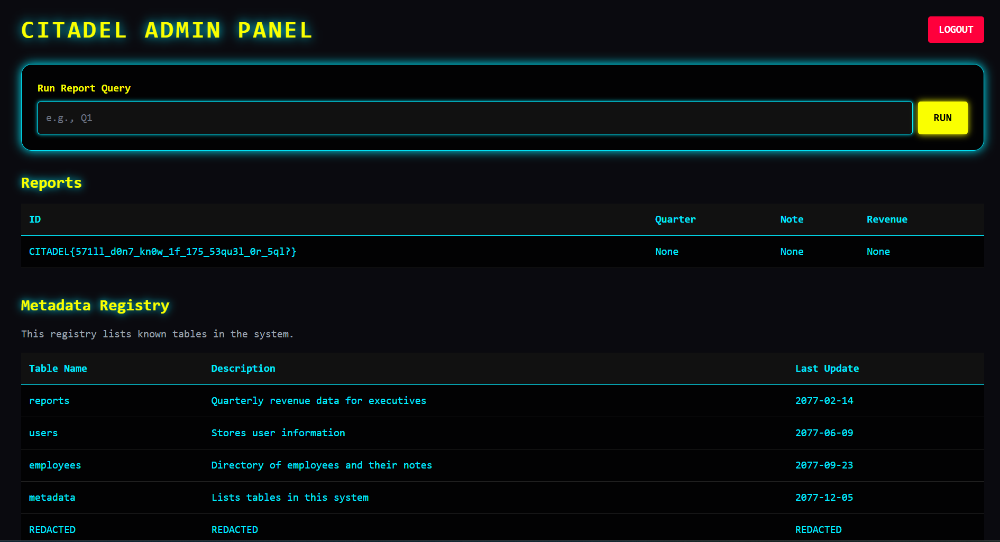

# 1. Database incursion 2.0:

Directly access the challenge server at https://database-incursion-v2.nitephase.live/

## Solution:

- First, i searched up database incursion, which is the name of the challenge on google, and learned that SQL injection is 1 way we can extract information from a database
- There was a login page, and we needed to login. I used the basic SQL payload which I used in other CTF challenges first to login and it worked.
```
' OR 1=1;--
```
- Then, after login, it took us to a page which asked for admin password and there was a list of employees, but we could only see 4 employees at a time.
- There was a hint that someone in management has the password.
- So i sorted the management employees by using this payload.
```
' OR Department='Management'--
```
- After this, there was another clue which told an employee named kiwi has the password. So I first tried sorting all the employees named Kiwi using this.
```
' OR Name='Kiwi'--
```
- There were 4 employees named Kiwi which showed up, but none of them were in management, and since we can only see 4 employees at a time, I used another payload which sorted all employees named kiwi and in management.
```
' OR (Department='Management' AND Name='Kiwi'--
```
- This reveals the password, and using this we can login as admin. Once we login as admin, I first used this payload to look at all the metatables in the report. 
```
' UNION SELECT * FROM metadata --
```
- This revealed a hidden table: CITADEL_ARCHIVE_2077. There was a coloumn named secrets in that and we have to extract it to get the flag. We have to extract it using UNION since using only SELECT didnt work for me.
```
' UNION SELECT secrets, NULL, NULL, NULL FROM CITADEL_ARCHIVE_2077 --
```
- This revealed the flag.



## Flag:

```
CITADEL{571ll_d0n7_kn0w_1f_175_53qu3l_0r_5ql?}
```

## Concepts learnt:

- I learnt about SQL injection and how we can use it, if the website is vulnerable to it to extract sensitive information from databases.
- I also learnt how we can use it to login as adminstrator to get higher privilages in the websites.


## Resources:

- https://medium.com/@shxdowz/light-ctf-write-up-a-deep-dive-into-sqlite-injection-and-enumeration-f0253a63171d
- https://github.com/swisskyrepo/PayloadsAllTheThings/tree/master
- https://ctf101.org/web-exploitation/sql-injection/what-is-sql-injection/
