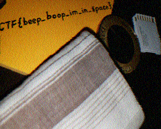

# 1. M00nwalk: 

Decode this message from the moon. 
Hints: How did pictures from the moon landing get sent back to Earth?, 

## Solution:

They gave a audio file which had some radio signals. From the hint they gave, which was how the moon landing photos got sent back to earth. They got sent back through radio signals, with radio telescopes on the ground. The images were then scanned using Slow-scan television (SSTV). So, we have to use a SSTV decoder to decode the audio file and we will get the flag. 



## Flag:

```
picoCTF{beep_boop_im_in_space}
```

## Concepts learnt:

- I learnt how moon landing pictures were sent back from space to earth through radio and then scanning the image using SSTV. I also learnt a little bit about SSTV. 

## Notes:

- I tried decoding the audio file in other ways, not with SSTV, but we have to use SSTV. 

## Resources:

- https://sstv-decoder.mathieurenaud.fr/

- ***
