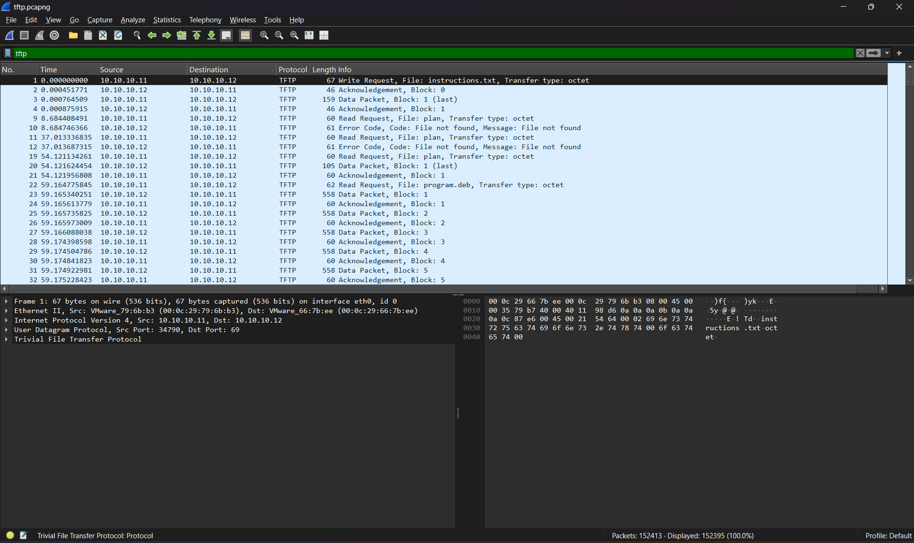

# 1. M00nwalk: 

Decode this message from the moon. 
Hints: How did pictures from the moon landing get sent back to Earth?, 

## Solution:

They gave a audio file which had some radio signals. From the hint they gave, which was how the moon landing photos got sent back to earth. They got sent back through radio signals, with radio telescopes on the ground. The images were then scanned using Slow-scan television (SSTV). So, we have to use a SSTV decoder to decode the audio file and we will get the flag. 


## Flag:

```
picoCTF{beep_boop_im_in_space}
```

## Concepts learnt:

- I learnt how moon landing pictures were sent back from space to earth through radio and then scanning the image using SSTV. I also learnt a little bit about SSTV. 

## Notes:

- I tried decoding the audio file in other ways, not with SSTV, but we have to use SSTV. 

## Resources:

- https://sstv-decoder.mathieurenaud.fr/

 ***

 # 2. Trivial flag transfer protocol: 

Figure out how they moved the flag.

Hint: What are some other ways to hide data?

## Solution:

- They gave a .pcapng file. So We have to first keep that file in Wireshark, then filter the protocol to tftp. I thought of this because the chalenge name is that.

- Then I followed a few of the networks and found somethings which had files with some text. I exported all the objects and saved them on my local disk. There were 2 text files, 3 images, and 1 deb file.
- I opened the instructions text file and there was a cipher, which looked like the caeser cipher. I used cyberchef to decode the cipher:
```
cipher: GSGCQBRFAGRAPELCGBHEGENSSVPFBJRZHFGQVFTHVFRBHESYNTGENAFSRE.SVTHERBHGNJNLGBUVQRGURSYNTNAQVJVYYPURPXONPXSBEGURCYNA

Decoded: TFTP DOESNT ENCRYPT OUR TRAFFIC SO WE MUST DISGUISE OUR FLAG TRANSFER.FIGURE OUT A WAY TO HIDE THE FLAG AND I WILL CHECK BACK FOR THE PLAN
```
There was also a plan text file, which also had a cipher, so I went and decoded it using cyberchef.
```
Cipher: VHFRQGURCEBTENZNAQUVQVGJVGU-QHRQVYVTRAPR.PURPXBHGGURCUBGBF

Decoded: I USED THE PROGRAM AND HID IT WITH-DUE DILIGENCE.CHECK OUT THE PHOTOS
```
Since it asked us to go check out the images, i guessed they probably hid something inside the photos using steganography. So I first learned a little about it and figured that we can use the steghide command in the bash. So I used that command along with the extract argument on all the 3 pictures they gave and got the flag on the third picture. The passphrase was given in the "plan" file after decoding, it was DUEDILIGENCE. 
```
saltycoder@LAPTOP-LP81GQQE:/mnt/c/USERS/ADMIN/Downloads$ steghide extract -sf picture1.bmp
Enter passphrase:
steghide: could not extract any data with that passphrase!
saltycoder@LAPTOP-LP81GQQE:/mnt/c/USERS/ADMIN/Downloads$ steghide extract -sf picture2.bmp
Enter passphrase:
steghide: could not extract any data with that passphrase!
saltycoder@LAPTOP-LP81GQQE:/mnt/c/USERS/ADMIN/Downloads$ steghide extract -sf picture3.bmp
Enter passphrase:
wrote extracted data to "flag.txt".
saltycoder@LAPTOP-LP81GQQE:/mnt/c/USERS/ADMIN/Downloads$ cat flag.txt
picoCTF{h1dd3n_1n_pLa1n_51GHT_18375919}
```

## Flag:

```
picoCTF{h1dd3n_1n_pLa1n_51GHT_18375919}
```

## Concepts learnt:

I learned about network analysis and steganography. Steganography is where content/files are hidden inside another file. Network analysis monitoring and examining a network's data traffic to detect and identify security threats and if needed intercept data. 

## Notes:

I initially didnt know what pcapng file was, so i tried directly extracting files from it, but we had to first keep it in wireshark and analyse it. Also after getting the text files, I took some time to identify it was a caeser cipher, specifically it was a ROT 13 cipher. I also took a while to find out the passphrase. 

## Resources:

https://github.com/JohnHammond/ctf-katana

Wireshark for network analysis

https://askubuntu.com/questions/1400195/extract-embed-file-from-cropped-image-using-steghide

https://cyberchef.org/

