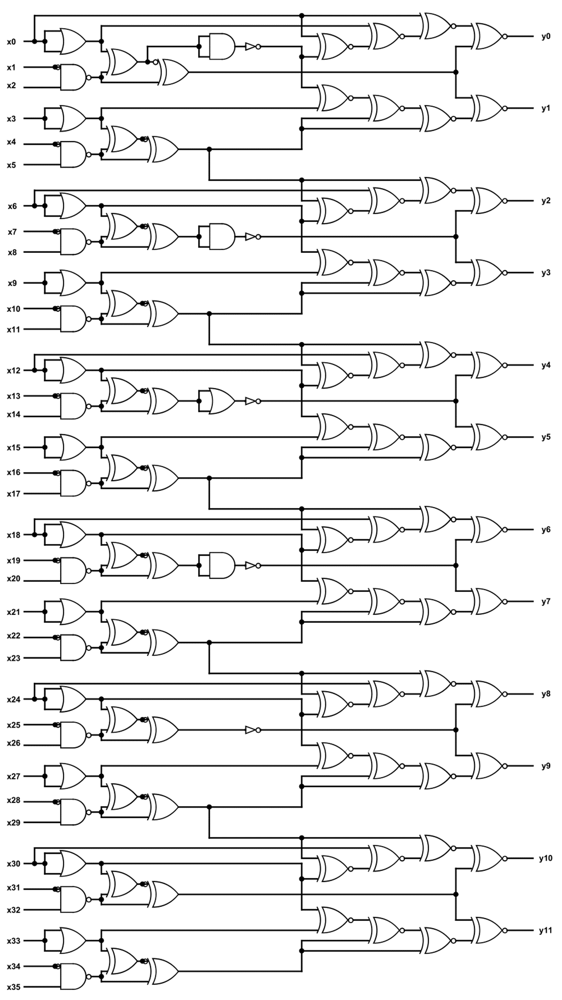
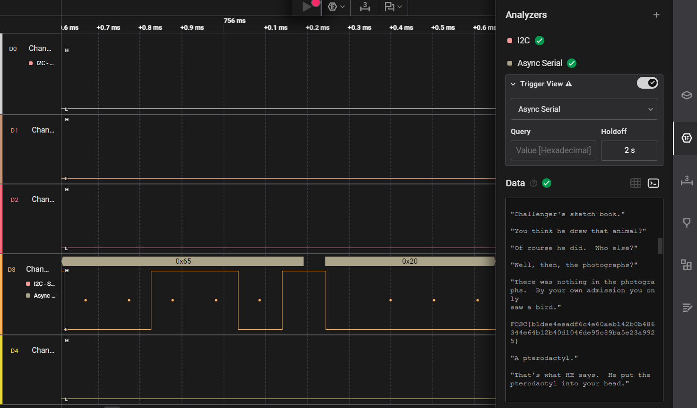

# 1. IQ test: 

let your input x = 30478191278.

wrap your answer with nite{ } for the flag.

As an example, entering x = 34359738368 gives (y0, ..., y11), so the flag would be nite{010000000011}.

They gave a Logic gate circuit and asked us to solve it.



## Solution:

- Since we have a logic gate circuit, which can only take 0 or 1, and they input given is in decimal, we first have to convert x to binary. We also should make sure it has 36 bits since we have 36 inputs. 

```
30478191278= 011100011010010010100100101010101110
```
- After we convert it to binary, we have to take x0 as the left most digit, and so on so x0=0, x1=1, x2=1, ..... Then we have to solve the logic gates either manually since they gave basic gates or we can use a code. I solved it manually
- If we observe carefully, each output is given by three inputs: y0 is given by x0, x1, x2, and so on, so we have to do it 12 times.
- After solving it, we will get the final output as 100010011000. 

## Flag:

```
nite{100010011000}
```

## Concepts learnt:

- I learnt how to solve complex circuits of logic gates. 

## Notes:

- It is a very dense and complex circuit, so we have to be careful while solving as a small mistake can be difficult to identify.  

## Resources:

- https://www.rapidtables.com/convert/number/decimal-to-binary.html

***

# 2. I like Logic:

i like logic and i like files, apparently, they have something in common, what should my next step be. 

They also gave a .sal file.

## Solution:

- They gave a .sal file, so I searched up what sal files are and how we can open them. I learnt that to view it, we need a sal analyser like Saleae Logic 2 software. So first I installed the software and set it up.
- After opening the file in the software, by clicking open a capture, I zoomed in on the D3 challenge file, and it had a pulsating square wave kind of signal. The rest of them had a straight line. Then we had to set up the analyser to Async serial, from I2C which was the default one. I thought of this as something similar was taught in my electronics class. After we set up the analyser to Async serial, we will get some hex values on the graph and we will also get a table of data, which we can export.
- I then exported the data table, and it gave it in a csv file format. I looked around in the table but could not find anything.
- I then opened the terminal code in the software, and there was some random story written in it, and in between the story the flag was there.



## Flag:

```
FCSC{b1dee4eeadf6c4e60aeb142b0b486344e64b12b40d1046de95c89ba5e23a9925}
```

## Concepts learnt:

- I learnt about what .sal files are, they store hardware analysis captures.
- I learnt how we can open sal files using the Logic 2 software and how we can analyse those files in that software.

## Notes:

- I first couldn't figure out why I couldn't add new analysers and why it told device disconnected, but later figured out that it should be like that and we have to click open capture to open the file.
- I first couldn't figure out where the flag was, until I figured out it was in the terminal. 

## Resources:

- Logic 2 software
- https://file.org/extension/sal

***

