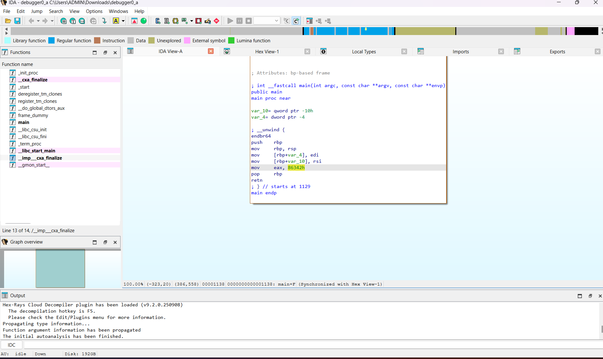
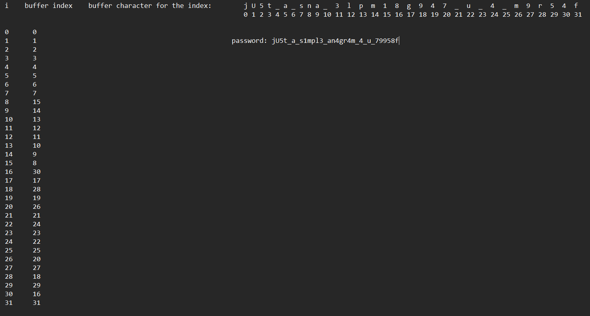

# 1. GDB Baby step 1:

Can you figure out what is in the eax register at the end of the main function? Put your answer in the picoCTF flag format: picoCTF{n} where n is the contents of the eax register in the decimal number base. If the answer was 0x11 your flag would be picoCTF{17}.

## Solution:

They gave a file that was in binary. Based on the challenge description, they told we have find what is in the eax registrar at the end of main function. So i disassembled the file using IDA, and searched for eax, there was a hexadecimal number over there. We have to convert it to decimal and then kept that in the flag. 



## Flag:

```
picoCTF{549698}
```

## Concepts learnt:

I learned we can use IDA to disassemble files to assembly language and use it to understand how the code works. I learned how to slightly infer from assemble language.

## Notes:

I first tried using online disassemblers, but they didnt work properly. 

## Resources:

IDA to disassemble the file, and also youtube videos given in JTP-2 pdf. https://youtube.com/watch?v=1d-6Hv1c39c, https://youtube.com/watch?v=gh2RXE9BIN8, https://youtube.com/playlist?list=PLMB3ddm5Yvh3gf_iev78YP5EPzkA3nPdL.

*** 

# 2. ARMssembly 1:

For what argument does this program print `win` with variables 81, 0 and 3? File: chall_1.S Flag format: picoCTF{XXXXXXXX} -> (hex, lowercase, no 0x, and 32 bits. ex. 5614267 would be picoCTF{0055aabb})

## Solution:

The file was a assembly language code, with a main function and another subfunction with three variables 81, 0, 3. I saw .file "chall_1.c" at the top, from which i understood that it has been converted to assembly from C. The algorithm was it took an argument, converted it to an integer from ASCII value, then it sent it to a function. If the function returned 0, then win was printed, otherwise lose was printed. Inside the function, first the first variable 81 was bitwise shifted the amount of times as the second variable (which is 0), so it basically did 81 << 0, which gave back 81, then that was divided with the 3rd variable (3), which gave 27, and that was substracted from the input given to the function, which is the argument we give and returned the result.

So we had to pass 27 as argument to get win printed. Then we have to convert 27 to hexadecimal which is 1b, and in the flag format they told its 32 bits, which will be 8 hexadecimal digits, so the final hexadecimal number will be 0000001b.

```
Assembly:

	.arch armv8-a
	.file	"chall_1.c"
	.text
	.align	2
	.global	func
	.type	func, %function
func:
	sub	sp, sp, #32
	str	w0, [sp, 12]
	mov	w0, 81
	str	w0, [sp, 16]
	str	wzr, [sp, 20]
	mov	w0, 3
	str	w0, [sp, 24]
	ldr	w0, [sp, 20]
	ldr	w1, [sp, 16]
	lsl	w0, w1, w0
	str	w0, [sp, 28]
	ldr	w1, [sp, 28]
	ldr	w0, [sp, 24]
	sdiv	w0, w1, w0
	str	w0, [sp, 28]
	ldr	w1, [sp, 28]
	ldr	w0, [sp, 12]
	sub	w0, w1, w0
	str	w0, [sp, 28]
	ldr	w0, [sp, 28]
	add	sp, sp, 32
	ret
	.size	func, .-func
	.section	.rodata
	.align	3
.LC0:
	.string	"You win!"
	.align	3
.LC1:
	.string	"You Lose :("
	.text
	.align	2
	.global	main
	.type	main, %function
main:
	stp	x29, x30, [sp, -48]!
	add	x29, sp, 0
	str	w0, [x29, 28]
	str	x1, [x29, 16]
	ldr	x0, [x29, 16]
	add	x0, x0, 8
	ldr	x0, [x0]
	bl	atoi
	str	w0, [x29, 44]
	ldr	w0, [x29, 44]
	bl	func
	cmp	w0, 0
	bne	.L4
	adrp	x0, .LC0
	add	x0, x0, :lo12:.LC0
	bl	puts
	b	.L6
.L4:
	adrp	x0, .LC1
	add	x0, x0, :lo12:.LC1
	bl	puts
.L6:
	nop
	ldp	x29, x30, [sp], 48
	ret
	.size	main, .-main
	.ident	"GCC: (Ubuntu/Linaro 7.5.0-3ubuntu1~18.04) 7.5.0"
	.section	.note.GNU-stack,"",@progbits

Code converted to C:

#include <stdio.h>
#include <stdlib.h>

int func(int input) {
    int a = 81;
    int b = 0;
    int c = 3;
    int d = (a << b);
    d = d / c;
    d = d - input;
    return d;
}

int main(int argc, char *argv[]) {
    int val = atoi(argv[1]);
    int result = func(val);
    if (result == 0) {
        puts("You win!");
    } else {
        puts("You Lose :(");
    }
    return 0;
}
```

## Flag:

```
picoCTF{0000001b}
```

## Concepts learnt:

I learnt about some basic assembly commands like MOV, LDR, STR, ADD, SUB, MUL, AND, ORR, LSL, LSR (LSL and LSR are bitwise shift operators which we use in this challenge), BEQ, BNE, etc. 

I also learned about the bits format, 32 bits will contain 32 binary digits, and 1 hexadecimal digit is equivalent to 4 binary digit, 1 octal digit is equivalent to 3 binary digits. 

## Notes:

I didnt know assembly, so i used an online assembly to C converter and then reverse engineered the C code, but i have to learn basic assembly. One more mistake i did was I didn't see the 32 bits part in the flag format and kept only the hex number which was only 2 digits (1b), instead of 8 digits. 

## Resources:

https://youtube.com/watch?v=1d-6Hv1c39c, https://youtube.com/watch?v=gh2RXE9BIN8, https://youtube.com/playlist?list=PLMB3ddm5Yvh3gf_iev78YP5EPzkA3nPdL. Assembly to C decompiler. 

*** 

# 3. Vault door 3:

This vault uses for-loops and byte arrays. The source code for this vault is here: VaultDoor3.java. 

## Solution:

In the Java code, there were two functions, one main, which was just for inputting password from user and telling if it was correct or wrong. The second function, which is a boolean function and the one we need, it checks if the password entered is correct or not.

In the checkpassword function, they created a buffer array, and then kept the contents of password entered by the user in the buffer in a specific pattern regulated by the loops. From fhe starting if statement, we can tell length of password is 32. At the last return statement, they told buffer should be "jU5t_a_sna_3lpm18g947_u_4_m9r54f". And buffer was just the password in a random order. 

So i made a table, telling which password bit is getting added to the buffer bit, and then rearranged it in order to get the password. 



```
Java file given:

import java.util.*;

class VaultDoor3 {
    public static void main(String args[]) {
        VaultDoor3 vaultDoor = new VaultDoor3();
        Scanner scanner = new Scanner(System.in);
        System.out.print("Enter vault password: ");
        String userInput = scanner.next();
	String input = userInput.substring("picoCTF{".length(),userInput.length()-1);
	if (vaultDoor.checkPassword(input)) {
	    System.out.println("Access granted.");
	} else {
	    System.out.println("Access denied!");
        }
    }
    
        public boolean checkPassword(String password) {
        if (password.length() != 32) {
            return false;
        }
        char[] buffer = new char[32];
        int i;
        for (i=0; i<8; i++) {
            buffer[i] = password.charAt(i);
        }
        for (; i<16; i++) {
            buffer[i] = password.charAt(23-i);
        }
        for (; i<32; i+=2) {
            buffer[i] = password.charAt(46-i);
        }
        for (i=31; i>=17; i-=2) {
            buffer[i] = password.charAt(i);
        }
        String s = new String(buffer);
        return s.equals("jU5t_a_sna_3lpm18g947_u_4_m9r54f");
    }
}
```

## Flag:

```
picoCTF{jU5t_a_s1mpl3_an4gr4m_4_u_79958f}
```

## Concepts learnt:

I learnt a little bit of how we can infer and try find out the algorithm of a java file. 

## Notes:

I first interprated the second function wrongly, I thought the password was the buffer itself.

## Resources:

https://youtube.com/watch?v=1d-6Hv1c39c, https://youtube.com/watch?v=gh2RXE9BIN8, https://youtube.com/playlist?list=PLMB3ddm5Yvh3gf_iev78YP5EPzkA3nPdL and the hint they gave in picoCTF. 
